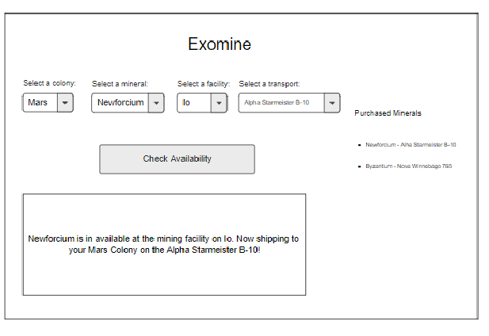

# Exomine

This project has you building an application that allows you govern different colonies in our Solar System purchase minerals from various mining facilities that humans have established.

## Learning Objectives

Completing the project is not your objective. Your focus is to building the following skills and deepen your knowledge of the concepts.

1. Collaboration (are you helping your team succeed)
1. Productivity (are you wasting too much time before asking for help)
1. Data types
1. Data structures
1. Navigating data relationships using primary keys and foreign keys

Quote from previous student...

> "This project has made me realize the importance of an ERD and quality design of your data structure and how to access that data."

## Wireframe

This is the general layout provided by your product owner. Please follow this guideline for your project's layout.

## Data Relationships

Below you can ready some basic information about the properties and relationships of the data you need for this application.

## Colonies

You will need at least three colonies in your application. (Two have been seeded for you. Invent one more in `scripts/database.js`!) Each colony can purchase mineral stock to help build their infrastructure. Colonies can purchase multiple types of minerals.

## Mining Facilities
You will need at least three mining facilities in your application. (Two have been seeded for you. Invent one more in `scripts/database.js`!) Each mining facilitiy needs to track which minerals that are current available at that facility. You don't need to worry about quantities of minerals. You can assume that all space minerals come in standard shipment sizes, and that each mining facility has an unlimited amount of minerals.

## Minerals
Any given mineral can be mined at many facilities and can be purchased by many colonies.

## An Important Word about Seed Data
Some of your data structure has been given to you. Take a look at `scripts/database.js` to see a starting point. This data structure is not comprehensive. **You will need to add more tables.** Read the above instructions and discuss with your team to figure out what tables you need to add.